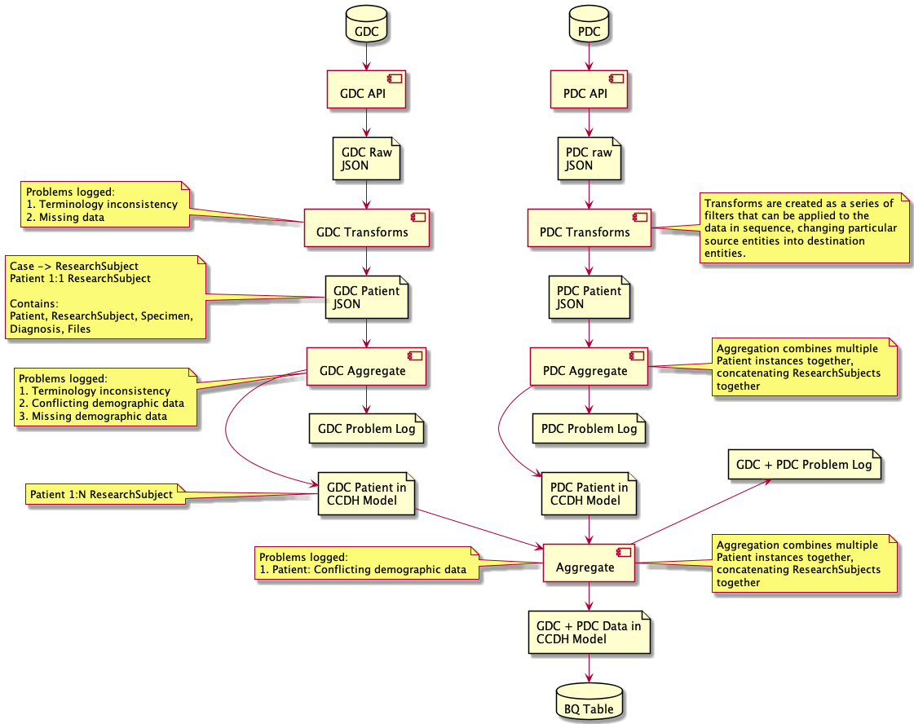

The goal of this repository is to provide standalone code that allows anybody to
perform an end-to-end ETL, starting from the DCs and ending up with a `.jsonl`
file they can upload to BQ.

# Transform flow




# Install

Clone repository and install
```
git clone git@github.com:CancerDataAggregator/transform.git
pip install -e .
```
or
```
git clone https://github.com/CancerDataAggregator/transform.git
pip install -e
```


# Extract raw JSONL from DCs

Pull all cases
```
extract-gdc gdc.jsonl.gz
extract-pdc pdc.jsonl.gz
```

OR, pull specific list of cases
```
extract-gdc gdc.jsonl.gz --cases gdc-case-list.txt
```

where `gdc-case-list.txt` looks like 

```
375436b3-66ac-4d5e-b495-18a96d812a69
74543fa4-ce73-46e4-9c59-224e8242b4a2
f8970455-bfb2-4b1d-ab71-3c5d619898ad
```

Examples are in `cdatransform/extract/*-case-list.txt`


# Transform and harmonize data

Python code for implementing transforms on data extracted from DCs

```
$ cda-transform -h
usage: Transform [-h] [--log LOG] [--case CASE] [--cases CASES] input output transforms

Transform source DC jsonl to Harmonized jsonl

positional arguments:
  input          Input data file.
  output         Output data file.
  transforms     Transforms list file.

optional arguments:
  -h, --help     show this help message and exit
  --log LOG      Name of log file.
  --case CASE    Transform just this case
  --cases CASES  Optional file with list of case ids (one to a line)
```

This code will ingest the raw data from the individual DCs (`.jsonl.gz` produced
by the extract-gdc scripts), apply transforms to the cases and write them back
out as another `.jsonl.gz` file ready for ingest into BQ or merging.

By default the log file is named `transform.log`

- [gdc-transform.yml](gdc-transform.yml): Sample transforms list file for GDC

- [gdclib.py](cdatransform/gdclib.py): Library of transforms for GDC 
- [pdclib.py](cdatransform/pdclib.py): Library of transforms for PDC 


# Load data into BigQuery

Install BQ command line tools as needed
```
brew install --cask google-cloud-sdk
```

Log into Google cloud

```
gcloud auth login
```

(This will let you set a default project, set this to `gdc-bq-sample`)


In this project there is a dataset called `kg-expt`. You can use your own.

```
bq load --autodetect --source_format NEWLINE_DELIMITED_JSON kg_expt.gdc gdc.d90249dc-40e8-449e-a24a-6d461f29f632.transf.json
```

# Example of how to load transformed GDC data into BQ

```
cd data
extract-gdc gdc.jsonl.gz 
cda-transform gdc.jsonl.gz gdc.transf.jsonl.gz ../gdc-transform.yml
bq load --autodetect --source_format NEWLINE_DELIMITED_JSON kg_expt.gdc gdc.transf.jsonl.gz
```

# [Example of creating small data sets for testing](tests/small/Readme.md)

# Testing out local install

```
git clone git@github.com:CancerDataAggregator/transform.git
cd transform
pip install -e .
```

Working on your own branch

```
git branch <mine>
git checkout <mine>
```

If you used the editable install (`pip install -e .`) Python will use your
changes live.
